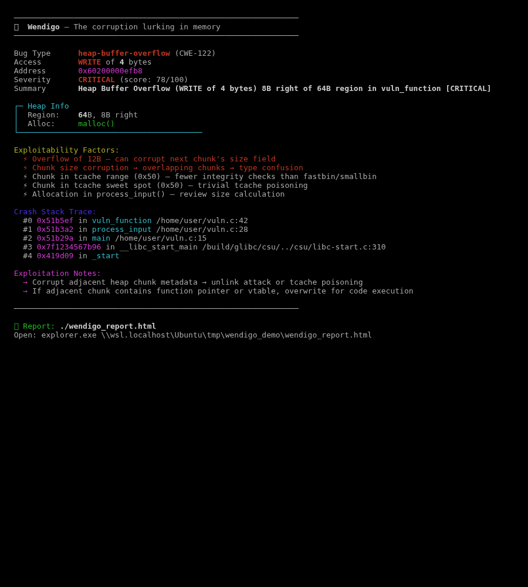
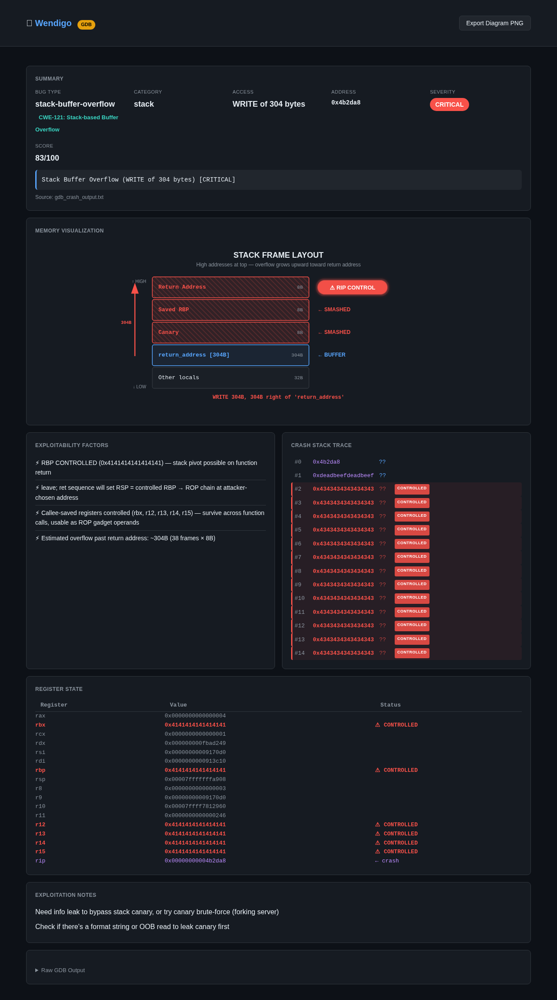
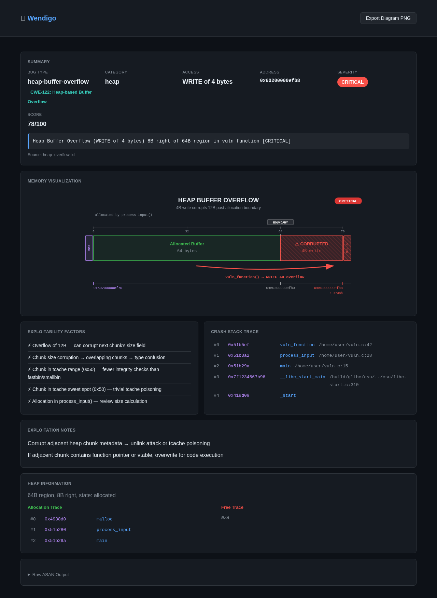

```
                    ╦ ╦╔═╗╔╗╔╔╦╗╦╔═╗╔═╗
                    ║║║║╣ ║║║ ║║║║ ╦║ ║
                    ╚╩╝╚═╝╝╚╝═╩╝╩╚═╝╚═╝
                    crash triage tool
```


---

Automated crash triage for security researchers. Feed it crashes — get exploitability scoring, memory visualizations, and exploitation strategy.

## Screenshots

### CLI Output


### Stack Buffer Overflow — RIP Control (GDB)


### Heap Buffer Overflow (ASAN)


---

## Setup

```bash
git clone https://github.com/oxmesh/wendigo.git
cd wendigo
chmod +x wendigo.py
sudo ln -sf $(pwd)/wendigo.py /usr/local/bin/wendigo
```

### Build Your Target with ASAN

```bash
# Single file
clang -fsanitize=address -g -O1 -o target_asan target.c

# Makefile
make CC=clang CXX=clang++ \
     CFLAGS="-fsanitize=address -g -O1" \
     CXXFLAGS="-fsanitize=address -g -O1" \
     LDFLAGS="-fsanitize=address"

# CMake
cmake -DCMAKE_C_COMPILER=clang \
      -DCMAKE_C_FLAGS="-fsanitize=address -g -O1" \
      -DCMAKE_EXE_LINKER_FLAGS="-fsanitize=address" ..
make
```

Already have ASAN/KASAN/GDB logs? Skip the binary: `wendigo --log crash.txt`

---

## Usage

```bash
# ASAN/KASAN/GDB log
wendigo --log crash.txt

# ASAN binary + crash file
wendigo -b ./target_asan --args "@@" -c crash_file

# Batch triage
wendigo -b ./target_asan --args "@@" -d ./crashes/ --html reports/

# AFL++ output (auto-detects binary + crashes)
wendigo --afl-dir /path/to/afl_output/

# Kernel KASAN with source
wendigo --log kasan.txt -s /path/to/kernel/src/

# JSON for scripting
wendigo -b ./target -d ./crashes/ --json | jq 'select(.score >= 70)'

# Pipe
./target < crash 2>&1 | wendigo --stdin-log
```

---

## What You Get

- **Exploitability score** (0-100) with contextual reasoning
- **CWE classification** — auto-mapped (CWE-121, CWE-122, CWE-416, etc.)
- **Checksec** — PIE, NX, canary, RELRO detection, factored into scoring
- **Exploitation hints** — attack strategy based on bug type + binary hardening
- **Memory visualization** — interactive SVG diagrams per bug type
- **Root cause analysis** — reads source, identifies vulnerable patterns
- **GDB register analysis** — controlled registers, RIP control, ROP potential
- **Crash dedup** — groups identical crashes by stack hash
- **Self-contained HTML reports** — single file, open in any browser

## How It Works

```
┌─────────────┐     ┌──────────────┐     ┌───────────────┐
│  Crash Input │────▶│    Parser     │────▶│   Analyzer    │
│ ASAN/GDB/K.. │     │ format detect │     │ scoring + CWE │
└─────────────┘     └──────────────┘     └───────┬───────┘
                                                  │
                    ┌──────────────┐     ┌────────▼────────┐
                    │  HTML Report  │◀────│   Visualizer    │
                    │  interactive  │     │ checksec + hints│
                    └──────────────┘     └─────────────────┘
```

## Scoring

Contextual — same bug type, different scores based on actual primitives:

| Scenario | Score |
|----------|-------|
| Heap overflow WRITE 4096B via memcpy | CRITICAL (85+) |
| Stack overflow with confirmed RIP control | CRITICAL (90+) |
| UAF WRITE (vtable hijack potential) | CRITICAL (80+) |
| Heap overflow WRITE 8B at chunk boundary | HIGH (65+) |
| 1-byte null overflow (chunk shrinking) | HIGH (55+) |
| UAF READ (info leak) | MEDIUM (40-50) |
| Null deref READ | NOT EXPLOITABLE |

Binary hardening factors in: no canary + stack overflow = higher score, no PIE = easier exploitation.

## Supported Formats

| Input | Description |
|-------|-------------|
| ASAN | Heap overflow, UAF, double-free, stack smash, global overflow |
| KASAN | Kernel slab OOB, kernel UAF, null-ptr-deref |
| GDB | Register state + backtrace (detects controlled regs, RIP control) |
| MSAN | Uninitialized memory reads |
| UBSAN | Integer overflow, invalid shifts, division by zero |

## Options

```
Input:
  --log, -l           ASAN/KASAN/GDB log file
  --binary, -b        ASAN-instrumented binary
  --args              Binary arguments (use @@ for crash file)
  --crash, -c         Single crash file
  --crash-dir, -d     Directory of crashes (batch)
  --afl-dir           AFL++ output directory (auto-detect)
  --stdin-log         Read log from stdin pipe

Output:
  --html, -o          HTML report path
  --json              JSONL to stdout

Analysis:
  --source-dir, -s    Source directory for root cause analysis
  --workers N         Parallel workers for batch
  --dedup-only        Group duplicates without full triage

Display:
  --quiet, -q         Results only
  --verbose, -v       Show reproduction output
```

## Credits

Built by [@oxmesh](https://github.com/oxmesh)

## License

[MIT](LICENSE)
